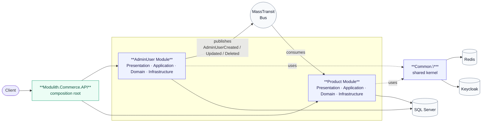
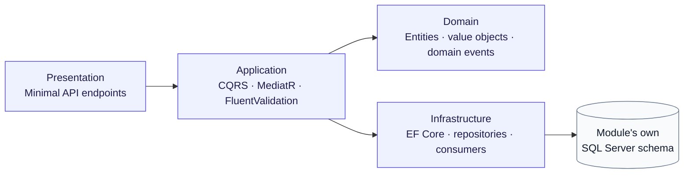
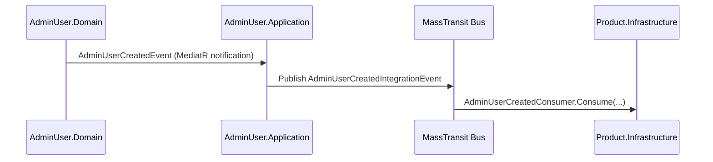

# Modulith.Commerce

A production-style **modular monolith** built on .NET 10 — Clean Architecture, CQRS via MediatR, DDD tactical patterns, and a pluggable Keycloak-based identity module. Module boundaries are microservice-ready: each module owns its domain, its data, and its migrations, and modules only talk to each other through published integration events. The whole system still ships and runs as a single deployable API.

> This repository is a public showcase copy of a private product codebase. It demonstrates the architecture, module boundaries, and infrastructure patterns; it is not the production system itself.

---

## Table of Contents

- [Architecture](#architecture)
- [Tech Stack](#tech-stack)
- [Solution Layout](#solution-layout)
- [Modules](#modules)
- [Inter-Module Communication](#inter-module-communication)
- [Getting Started](#getting-started)
- [Running the API](#running-the-api)
- [Authentication](#authentication)
- [Database Migrations](#database-migrations)
- [Observability](#observability)

---

## Architecture

Each module is sliced into four layers, following Clean Architecture:

```
Domain          → Entities, value objects, domain events, invariants. No framework dependencies.
Application     → CQRS commands/queries (MediatR), validators (FluentValidation), DTOs, use cases.
Infrastructure  → EF Core DbContext, repositories, messaging consumers, caching, migrations.
Presentation    → Minimal API endpoint definitions, request/response contracts, mapping (AutoMapper).
```

A `Common.*` set of libraries provides the shared kernel used by every module:

| Library | Responsibility |
|---|---|
| `Common.Domain` | Base entity/aggregate abstractions, domain event dispatching contracts |
| `Common.Application` | MediatR pipeline behaviors — logging, validation, exception handling, query caching |
| `Common.Infrastructure` | EF Core conventions, JWT bearer auth wiring, MassTransit bus configuration, Redis caching, repository base classes |
| `Common.Auth` | Typed Keycloak Admin REST client (token acquisition, user management) |

The host process (`Modulith.Commerce.API`) is a thin composition root: it registers each module's DI, wires API versioning, aggregates each module's Swagger document, and applies each module's EF Core migrations at startup. It contains no business logic of its own.

**System view** — how the host, modules, shared kernel, and infrastructure fit together:



**Module internals** — every module follows the same layering (shown once, applies to both):



## Tech Stack

| Layer | Technology |
|---|---|
| Runtime | .NET 10, ASP.NET Core Minimal APIs |
| CQRS / Mediator | MediatR 13 |
| Validation | FluentValidation 12 |
| ORM | Entity Framework Core 10 (SQL Server provider) |
| Messaging | MassTransit 8 (in-memory transport, publish/subscribe integration events) |
| Caching | Redis (`Microsoft.Extensions.Caching.StackExchangeRedis`) |
| Authentication | Keycloak 26 — OpenID Connect + JWT Bearer, typed admin REST client |
| API Versioning | Asp.Versioning (URL-segment versioning, per-module version sets) |
| API Docs | Swashbuckle / OpenAPI, one Swagger document per module |
| Object Mapping | AutoMapper |
| Logging | Serilog (console, Seq sink, environment/process/thread enrichers) |
| Health Checks | AspNetCore.HealthChecks (SQL Server, Redis, Seq, HTTP) |
| DI Convenience | Scrutor (assembly scanning registration) |
| Containers | Docker, Docker Compose |

## Solution Layout

```
API/
  Modulith.Commerce.API/            → Composition root: startup, versioning, Swagger, migrations
Common/
  Modulith.Commerce.Common.Domain/          → Shared domain abstractions
  Modulith.Commerce.Common.Application/     → Shared MediatR pipeline behaviors
  Modulith.Commerce.Common.Infrastructure/  → Shared EF Core, auth, messaging, caching plumbing
  Modulith.Commerce.Common.Auth/            → Keycloak admin client
Contracts/
  Modulith.Commerce.AdminUsers.IntegrationEvents/  → Cross-module event contracts (published by AdminUser, consumed by Product)
Modules/
  AdminUser/
    Modulith.Commerce.AdminUser.Domain/
    Modulith.Commerce.AdminUsers.Application/
    Modulith.Commerce.AdminUsers.Infrastructure/
    Modulith.Commerce.AdminUsers.Presentation/
  Product/
    Modulith.Commerce.Products.Domain/
    Modulith.Commerce.Products.Application/
    Modulith.Commerce.Products.Infrastructure/
    Modulith.Commerce.Products.Presentation/
keycloak/
  import/                            → Realm export auto-imported on first Keycloak boot
docker-compose.yml
```

## Modules

### AdminUser

Owns administrator identity: creation, updates, status, team assignment. Bridges local admin-user records with Keycloak (creates/updates the corresponding Keycloak account through `Common.Auth`'s admin client) and bootstraps the first administrator account on first run from `module.admin-users.json` / `module.admin-users.Development.json`.

### Product

Owns product catalog: creation, publishing workflow, SEO fields, status. Reacts to admin-user lifecycle events (created/updated/deleted) published by the AdminUser module, so it can, for example, keep denormalized author/owner references in sync without querying the AdminUser database directly.

Each module owns an isolated `DbContext` and its own EF Core migrations — **no module reads or writes another module's tables directly.**

## Inter-Module Communication

Modules never reference each other's `Domain`, `Application`, or `Infrastructure` projects. The only shared surface is the `Contracts` project:

1. AdminUser's `Application` layer handles an internal `INotificationHandler<TDomainEvent>` (MediatR) when an admin-user domain event fires.
2. That handler publishes a corresponding **integration event** (defined in `Contracts/Modulith.Commerce.AdminUsers.IntegrationEvents`) onto the bus via MassTransit's `IPublishEndpoint`.
3. The Product module's `Infrastructure` layer registers a MassTransit `IConsumer<T>` for each event it cares about (`AdminUserCreatedConsumer`, `AdminUserUpdatedConsumer`, `AdminUserDeletedConsumer`) and reacts independently.

The bus currently runs on MassTransit's **in-memory transport** — sufficient for a single-process monolith, and swappable for RabbitMQ/Azure Service Bus/etc. without touching module code, since modules only depend on MassTransit abstractions.



## Getting Started

### Prerequisites

- [.NET 10 SDK](https://dotnet.microsoft.com/download)
- [Docker](https://www.docker.com/) + Docker Compose
- No local SQL Server/Redis/Keycloak install needed — Compose provisions all of it

### 1. Clone and configure environment

```bash
git clone <repository-url>
cd Modulith.Commerce
cp .env.example .env
```

`.env.example` ships with values that already match the client secrets baked into `keycloak/import/modulith-commerce-realm.json`, so the stack works out of the box in local dev. Change both together if you edit the realm file.

### 2. Start the stack

```bash
docker compose up --build
```

This brings up, in order: SQL Server → Keycloak (auto-imports the `modulith-commerce` realm) → Redis, Seq, and the API. The API container waits on all dependency health checks before starting.

### 3. First run — bootstrap an administrator

Before starting, set a real email/password in `API/Modulith.Commerce.API/module.admin-users.Development.json`:

```json
{
  "Bootstrap": {
    "AdministratorEmail": "admin@example.com",
    "AdministratorFirstName": "System",
    "AdministratorLastName": "Administrator",
    "AdministratorPassword": "<strong password>"
  }
}
```

On first boot, `BootstrapAdministratorHostedService` creates this account in both the local AdminUser store and Keycloak if no administrator exists yet. This is how you obtain your first login — nothing is auto-generated or printed to logs.

### Endpoints once running

| Service | URL |
|---|---|
| API | http://localhost:5000 |
| Swagger UI (per-module docs) | http://localhost:5000/swagger |
| Keycloak Admin Console | http://localhost:8082 |
| Seq (structured logs) | http://localhost:5342 |
| SQL Server | `localhost,1433` |
| Redis | `localhost:6379` |

## Authentication

Identity is delegated entirely to **Keycloak** (realm `modulith-commerce`, imported automatically from `keycloak/import/modulith-commerce-realm.json`):

- The API validates incoming requests as JWT bearer tokens issued by Keycloak (`Keycloak__Authority` / `Keycloak__ValidIssuer`).
- `Common.Auth` exposes a typed HTTP client for Keycloak's Admin REST API, used by the AdminUser module to provision/update/delete Keycloak accounts alongside local admin-user records.
- Two Keycloak clients are configured: a confidential `modulith-commerce-admin-client` (server-to-server admin operations) and `modulith-commerce-web` (interactive/browser login).

## Database Migrations

Each module's `Infrastructure` project owns its own EF Core migrations against its own `DbContext` (`AdminUsersDbContext`, `ProductsDbContext`) inside a shared SQL Server instance, but logically isolated schemas. Migrations are applied automatically at API startup via `app.ApplyModuleMigrations<TContext>()` — no manual `dotnet ef database update` step is required for local development.

To add a migration for a module:

```bash
dotnet ef migrations add <Name> \
  --project Modules/Product/Modulith.Commerce.Products.Infrastructure \
  --startup-project API/Modulith.Commerce.API
```

## Observability

- **Structured logging** via Serilog, enriched with environment/process/thread context, shipped to [Seq](http://localhost:5342).
- **Health checks** for SQL Server, Redis, Seq, and dependent HTTP endpoints (`AspNetCore.HealthChecks.*`).
- **Request logging middleware** (`UseSerilogRequestLogging`) on every inbound request.
